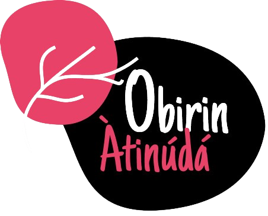

 

# Índice

- [Logo do Projeto](#Título-e-Imagem-de-capa)
- [Índice](#índice)
- [Descrição do Projeto](#descrição-do-projeto)
- [Status do Projeto](#status-do-Projeto)
- [Funcionalidades e Demonstração da Aplicação](#funcionalidades-e-demonstração-da-aplicação)
- [Acesso ao Projeto](#acesso-ao-projeto)
- [Tecnologias utilizadas](#tecnologias-utilizadas)
- [Pessoas Desenvolvedoras do Projeto](#pessoas-desenvolvedorasa)

# Descrição do Projeto

O projeto baseia-se em um espaço acolhedor e inclusivo para que as mulheres periféricas possam deixar sua história eternizada no ambiente virtual. Através das revistas disponibilizadas para download no site. Compreendendo a importância da democratização do acesso à cultura. Registrando o arquivo cultural histórico. Buscando impacto social. Cuidado com a memória cultural periférica. E o mais importante dar visibilidade ao potencial criativo de mulheres da periferia de São Paulo!

<h4 align="center"> 
    :construction:  Projeto em construção  :construction:
</h4>

# 🔨 Funcionalidades do projeto

- `Funcionalidade 1`: A página inicial é a Sobre. Nela você encontrará a história da Coletiva FALA GUERREIRA e sobre as integrantes do Projeto Oririn Atinundá. Poderá também navegar pela navBar e explorar as demais páginas (sobre, galeria,revistas e documentário). Abaixo terá o footer com as nossas logos.
- `Funcionalidade 2`: Na página da galeria terá um pouco dos registros feitos pelas participantes da FALA GUERREIRA (ainda em construção).
- `Funcionalidade 3`: Na página Revistas, ficam os arquivos das 6 revistas para download. Apenas clicando diretamente em cada revista, você poderá baixar cada uma delas.
- `Funcionalidade 4`: Na página "Documentário" temos uma explicação sobre o documentário bem como o mesmo incorporado a página.

# Acesso ao Projeto

...

## ✔️ Técnicas e tecnologias utilizadas

- `Javascript`
- `Visual Studio Code`
- `HTML`
- `CSS`
- `Metodologias ágeis`
- `GitHub`

# Autores

| [ Rayssa Luna](https://github.com/rayssaluna) | [ Raquel Resende](https://github.com/RaquelResende) | [ Danielle Braga](https://github.com/danifemsib) | [ Dani Souza](https://github.com/danisoulz) |
| :---------------------------------------------------------------------------------------------------------------------------------------------------: | :----------------------------------------------------------------------------------------------------------------------------------------------------------------------------------------------------------: | :------------------------------------------------------------------------------------------------------------------------------------------------------: | --------------------------------------------------------------------------------------------------------------------------------------------------- |
